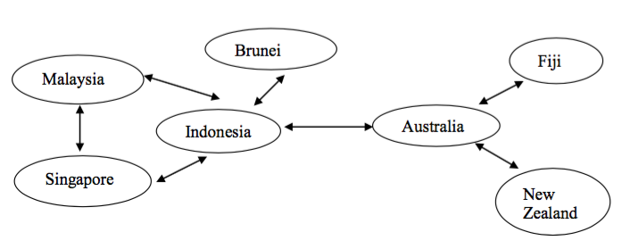

######Connor Beardsmore - 15504319
######Semester 1, 2016

##CC200 Assignment  

#####Purpose

Implementation of a *Sliding Window* protocol on a network of 7 nodes. The protocol is built for use on the CNET network simulator and utilizes functionality from the CNET API. The network topology and node links are illustrated below.

	

 
#####File List

	.c FILES
	--------
	assignment.c

	.h FILES
	--------
	assignment.h

	OTHER
	-----
	Makefile
	README.md
	ASSIGNMENT

#####Instructions to Run

The protocol is designed to work on the CNET network simulator and thus, requires a CNET installation to run. CNET documentation can be found at the following link:

<http://www.csse.uwa.edu.au/cnet/>

To execute the simulation through CNET, run the following command and flags:

	cnet -s -O ASSIGNMENT

CNET has a range of flags that can be employed for various additional functionality.
After running, all created log and executable files can be removed via:

	make clean

#####References

none